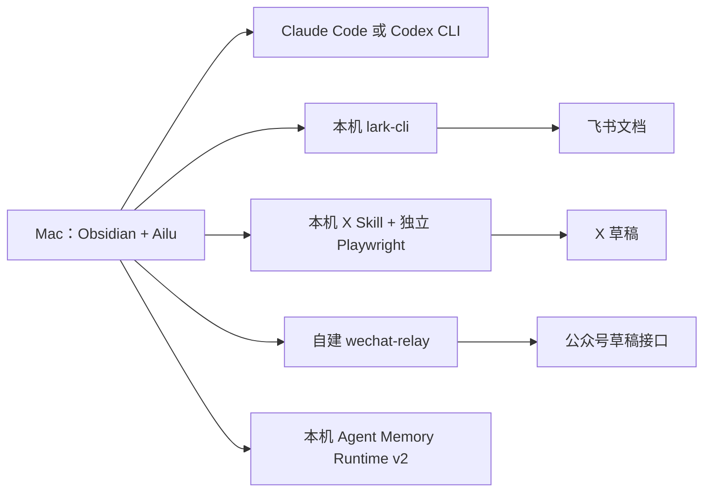

# Ailu 完整安装与集成配置

这份指南面向第一次接触 Ailu 的使用者。完成 README 的 Release 安装或源码构建安装，只能证明“插件、Agent 对话和本地草稿预览可用”；公众号、X Article、飞书和 Agent Memory 都是独立集成，需要分别安装、配置和验收。

不要把 AppSecret、Cookie 值、Relay Token、飞书令牌、SSH 私钥或真实记忆内容粘贴到聊天、Issue、日志或 Git。下文的 `<...>` 都是占位符，必须换成使用者自己的值。

## 先看懂各组件在哪里运行



公众号的 AppSecret 只在服务器；X Cookie 只在本机私密目录；飞书令牌由 `lark-cli` 管理；Agent Memory 的 Markdown 根目录由使用者自己选择。Ailu 不提供共享云端账号，也不会代替这些组件完成安装。

## 0. 先完成核心安装

先严格完成 [README 的推荐安装流程](../README.md#从-release-安装推荐) 和“首次启动验收”。需要审计或修改源码时，也可使用 README 的源码构建安装流程。成功信号是：

- 设置页至少有一个 Agent 显示已就绪；
- Plan 模式下发送 `只回复 OK，不读写任何文件。` 能收到 `OK`；
- 打开一篇 Markdown 后，`Ailu: 打开创作台` 能显示本地预览。

核心验收没通过时，不要同时排查下面四个集成。它们均为可选项，缺失不会阻断普通对话。

## 1. 配置公众号服务器与中转服务

### 1.1 准备服务器和公众号参数

你需要：

- 可匿名读取的公开仓库 [`mcncarl/wechat-relay`](https://github.com/mcncarl/wechat-relay) 及其固定 [`0.1.0` Release](https://github.com/mcncarl/wechat-relay/releases/tag/0.1.0)；
- 一台 Ubuntu 24.04 VPS（虚拟专用服务器），具有真实、长期稳定的公网出口 IPv4；
- Node.js 22，以及 `build-essential`、Python 3、Git、OpenSSL；
- 公众号 AppID、AppSecret，并由账号管理员把这台 VPS 的实际出口 IPv4 加入公众号 API 白名单；
- 二选一的正式入口：Tailscale Serve，或自有域名 + Caddy HTTPS。

白名单填写的是服务器访问微信接口时使用的出口 IPv4，不是 Mac 地址、Tailscale 地址、域名或反向代理地址。域名和 Tailscale 只能解决“Mac 如何进入服务器”，不能替代微信的出口 IP 白名单。

AppSecret 只能进入服务器的 root-only 环境文件，绝不能填入 Ailu。

### 1.2 在 Ubuntu 上安装 relay

relay 自带的 systemd unit 固定执行 `/usr/bin/node`，因此必须通过服务器的受信任系统级包管理方案安装 Node.js 22.x，并确保 Node 和 npm 对系统账号可见。不要使用只存在于登录用户 Home 的 nvm/fnm/asdf/mise 版本，也不要默认使用 Ubuntu 仓库中可能较旧的 Node。版本选择可参考 [Node.js 官方下载说明](https://nodejs.org/en/download)，但最终必须满足下面的实际路径契约：

```bash
test "$(command -v node)" = "/usr/bin/node"
test "$(command -v npm)" = "/usr/bin/npm"
/usr/bin/node --version
/usr/bin/npm --version
```

`/usr/bin/node --version` 必须显示 `v22.x`，`/usr/bin/npm --version` 必须正常输出。然后安装其余系统依赖并创建不可交互登录的专用构建账号：

```bash
sudo apt update
sudo apt install --yes build-essential python3 git openssl

sudo useradd --system --create-home \
  --home-dir /var/lib/wechat-relay-build \
  --shell /usr/sbin/nologin wechat-relay-build

sudo install -d -m 0755 \
  -o wechat-relay-build \
  -g wechat-relay-build \
  /opt/wechat-relay

sudo -H -u wechat-relay-build /usr/bin/node --version
sudo -H -u wechat-relay-build /usr/bin/npm --version
```

最后两条也必须正常输出；它们证明构建账号实际看得到依赖。若 `/usr/bin/node` 不存在，不要靠修改 systemd unit 或指向个人 Home 的临时符号链接绕过，应先修正系统级 Node 安装。

公开仓库不需要 GitHub Token、Deploy Key 或账号登录。以构建账号匿名克隆固定 tag，并安装生产依赖：

```bash
sudo -H -u wechat-relay-build \
  git clone --branch 0.1.0 --depth 1 \
  https://github.com/mcncarl/wechat-relay.git /opt/wechat-relay

cd /opt/wechat-relay
sudo -H -u wechat-relay-build /usr/bin/npm ci --omit=dev
sudo chown -R root:root /opt/wechat-relay
sudo chmod -R u=rwX,go=rX /opt/wechat-relay
```

成功信号：`/opt/wechat-relay/node_modules/better-sqlite3` 存在，安装命令没有原生模块编译错误。切换 Node 大版本后不能复用旧 `node_modules`，必须重新执行 `/usr/bin/npm ci --omit=dev`。

### 1.3 创建 root-only 配置

生成一个至少包含 32 个随机字节的 Relay Token：

```bash
openssl rand -base64 48
```

只在安全位置暂存输出，然后创建服务器环境文件：

```bash
sudo install -d -m 0750 -o root -g root /etc/wechat-relay
sudo install -m 0600 -o root -g root \
  /dev/null /etc/wechat-relay/wechat-relay.env
sudoedit /etc/wechat-relay/wechat-relay.env
```

文件只填写下列三项，尖括号内容必须替换：

```dotenv
WECHAT_APP_ID=<公众号 AppID>
WECHAT_APP_SECRET=<公众号 AppSecret>
RELAY_TOKEN=<openssl 生成的随机 Token>
```

不要把仓库中的 `.env.example` 当成会被自动加载的生产配置；systemd 读取的是 `/etc/wechat-relay/wechat-relay.env`。

### 1.4 启动并先在服务器本机验收

```bash
cd /opt/wechat-relay
sudo install -m 0644 deploy/wechat-relay.service \
  /etc/systemd/system/wechat-relay.service
sudo systemctl daemon-reload
sudo systemctl enable --now wechat-relay.service
sudo systemctl status wechat-relay.service
```

服务应只监听 `127.0.0.1:18794`，不要改成 `0.0.0.0`，也不要把 18794 暴露到公网。

第一层只检查进程是否存活：

```bash
curl --fail --silent --show-error \
  http://127.0.0.1:18794/v1/health
```

必须返回：

```json
{"ok":true}
```

第二层检查 SQLite、公众号凭据、网络和 IP 白名单。以下写法通过 curl 配置的标准输入传 Token，避免把 Token 放进命令参数：

```bash
sudo --preserve-env=PATH bash
set -a
. /etc/wechat-relay/wechat-relay.env
set +a
curl --fail --silent --show-error --config - <<EOF
url = "http://127.0.0.1:18794/v1/ready"
header = "Authorization: Bearer ${RELAY_TOKEN}"
EOF
exit
```

必须返回：

```json
{"ready":true}
```

`health` 成功只代表进程活着；只有 `ready` 成功才代表公众号凭据、出口 IP 白名单和本地状态都可用。Ailu 当前没有“测试中转连接”按钮，因此保存设置不等于中转已验收。

### 1.5 选择一种正式 HTTPS 入口

#### 路线 A：Tailscale Serve

先按 [Tailscale 官方 Linux 安装说明](https://tailscale.com/kb/1031/install-linux)安装并登录，让服务器和安装 Ailu 的 Mac 加入同一 tailnet（Tailscale 私有网络），再用 ACL（访问控制列表）只允许指定用户或设备访问 relay。确认 `tailscale status` 能看到两台设备后，服务器执行：

```bash
sudo tailscale serve --bg --https=443 http://127.0.0.1:18794
sudo tailscale serve status
```

成功信号：状态中出现一个 tailnet 内的 HTTPS MagicDNS 地址，例如：

```text
https://relay-node.example-tailnet.ts.net
```

不要开启 Tailscale Funnel；Funnel 会把服务变成公网入口。Ailu 要填写上述 HTTPS 地址，不是 `localhost`。

#### 路线 B：域名 + Caddy

把域名的 DNS `A` 记录指向 VPS 的固定 IPv4，只对公网放行所需的 SSH 和 TCP 80/443，永远不要开放 18794。按 [Caddy 官方 Debian/Ubuntu 安装说明](https://caddyserver.com/docs/install#debian-ubuntu-raspbian)安装 Caddy 后，以 relay 仓库的 `deploy/Caddyfile.example` 为基线替换域名，再执行：

```bash
sudo caddy validate --config /etc/caddy/Caddyfile
sudo systemctl reload caddy
```

成功信号：从安装 Ailu 的 Mac 执行 `curl https://relay.example.com/v1/health` 返回 `{"ok":true}`，且 TLS 证书有效。

当前 relay 的正式生产文档不包含 Docker Compose、Cloudflare Tunnel 或 SSH 本地转发。不要把这些路线写成已验证方案；Cloudflare 也不能替代微信需要的固定出口 IPv4。

### 1.6 在 Ailu 中填写中转配置

打开 **Obsidian 设置 → Ailu → 草稿**，填写：

- **草稿通道**：`自托管公众号中转`；
- **中转地址**：Tailscale Serve 的 HTTPS MagicDNS 根地址，或 Caddy 的 HTTPS 域名根地址；不要加 `/v1`、query 或 hash；
- **中转 Token**：与服务器 `RELAY_TOKEN` 完全一致；
- **公众号 AppID（仅作标记）**：填写同一个 AppID，供最终确认时人工核对。

公网地址必须是 HTTPS。中转 Token 保存于 Obsidian SecretStorage；AppID 只是本地标签，不会替代服务器配置；AppSecret 永远不进入 Ailu。

最后打开一篇专用测试 Markdown，在创作台先完成本地检查，再点击上传并核对最终确认框。只有使用者确认后才会创建公众号草稿并回读；Ailu 没有群发或正式发布入口。本指南不会替使用者操作公众号后台或执行真实上传。

成功信号：界面显示草稿已创建和正文图片核验结果。若接口已经返回 `media_id`、但回读失败，先由使用者人工检查草稿箱，不能直接重试制造重复草稿。

### 1.7 公众号常见错误

- `/health` 成功、`/ready` 失败：检查 AppID、AppSecret、服务器真实出口 IPv4 白名单、到微信接口的 HTTPS 连通性和 SQLite 可写空间。
- `401 unauthorized`：Ailu 中转 Token 与服务器 `RELAY_TOKEN` 不一致。
- Ailu 拒绝中转地址：公网使用了 HTTP，或地址含账号密码、query（查询参数）或 hash（片段）。若误加 `/v1`，地址可能保存，但 Ailu 会在其后继续拼接 `/wechat/...`，导致端点错误；删掉 `/v1` 后重试。
- Tailscale 无法访问：检查 Mac 是否在同一 tailnet、ACL 和 Serve 状态；不要改开 Funnel。
- Caddy 无法访问：检查 DNS、证书和 80/443；不要用开放 18794 作为绕过方案。
- `idempotency_replay_blocked` 或结果不确定：先核对公众号草稿箱，不要换幂等键盲目重试。

## 2. 配置 X Article Skill 和 Cookie

### 2.1 先取得与当前 Ailu 匹配的 Skill

Ailu 不捆绑 `x-article-draft-uploader`。Ailu `0.2.0` 当前复核并固定使用下面的公开版本：

- 仓库：[`mcncarl/yichen-skills`](https://github.com/mcncarl/yichen-skills)
- tag：[`x-article-draft-uploader-v1.0.1`](https://github.com/mcncarl/yichen-skills/tree/x-article-draft-uploader-v1.0.1/yichen-x-article-draft-uploader)
- commit：[`9f679d9f28d656eb01b60d806faa709f85173c51`](https://github.com/mcncarl/yichen-skills/commit/9f679d9f28d656eb01b60d806faa709f85173c51)
- 结果契约：`x-article-persistence-v1`

不要安装会继续变化的任意 `main` 快照。首次安装到 Ailu 可发现的 Codex 目录时，直接运行下面的固定版本命令。它先检查目标目录，已有旧版本时只报错，不会覆盖：

```bash
(
  skill_target="$HOME/.codex/skills/x-article-draft-uploader"
  if [ -e "$skill_target" ]; then
    printf '目标 Skill 已存在；未覆盖。请先核对现有版本：%s\n' "$skill_target" >&2
    exit 1
  fi
  npx --yes skills@1.5.22 add \
    "https://github.com/mcncarl/yichen-skills/tree/x-article-draft-uploader-v1.0.1/yichen-x-article-draft-uploader" \
    --skill x-article-draft-uploader --global --agent codex --copy --yes
)
```

当前 Ailu 只会自动发现以下两个精确目录名：

```text
~/.agents/skills/x-article-draft-uploader/
~/.codex/skills/x-article-draft-uploader/
```

上面的固定命令安装到 `~/.codex/skills/x-article-draft-uploader/`；Ailu 可以直接发现。手工管理多个 Agent 时，也可以统一安装到 `~/.agents/skills/x-article-draft-uploader/`。目录内至少应有：

```text
SKILL.md
scripts/upload_markdown_to_x_article.py
scripts/parse_markdown.py
scripts/export_x_cookies_from_chrome.py
requirements.txt
VERSION
LICENSE
```

只装到 `~/.claude/skills/` 不会被 Ailu 自动发现。若在设置页手填上传脚本，必须填写完整绝对路径；该字段不会展开 `~`。

仅在需要手工安装到 `~/.agents` 时，先检出上面的固定 tag，确认源目录存在、目标不存在，再复制并改成 Ailu 识别的目录名；下面的分支在目标已存在时只报错，不会执行 `cp`：

```bash
AILU_X_SKILL_SOURCE="/绝对路径/已复核的/yichen-x-article-draft-uploader"
AILU_X_SKILL_TARGET="$HOME/.agents/skills/x-article-draft-uploader"

if [ ! -d "${AILU_X_SKILL_SOURCE}" ]; then
  printf '源 Skill 目录不存在；未安装。\n' >&2
elif [ -e "${AILU_X_SKILL_TARGET}" ]; then
  printf '目标 Skill 已存在；未覆盖。请先核对现有版本。\n' >&2
else
  mkdir -p "$(dirname "${AILU_X_SKILL_TARGET}")"
  cp -R "${AILU_X_SKILL_SOURCE}" "${AILU_X_SKILL_TARGET}"
fi
```

该 Skill 使用其自身的个人学习与非商业协议：客户交付、付费产品或服务、公司内部部署、市场打包、课程打包及其他商业用途，必须事先取得作者明确书面授权。具体联系方式和完整条款见 Skill 目录中的 `LICENSE`；该限制不因 Ailu 使用 AGPL 而改变，也不适用于 Ailu 核心。

### 2.2 安装独立 Python 与 Playwright 环境

建议为 X 上传器建立独立虚拟环境，避免 Finder 启动的 Obsidian 找不到 shell 中的 Python 包。下面默认使用固定命令安装后的 `~/.codex` 路径；若手工装在 `~/.agents`，只改 `AILU_X_SKILL_HOME` 这一行：

```bash
(
  AILU_X_SKILL_HOME="$HOME/.codex/skills/x-article-draft-uploader"
  if [ ! -f "$AILU_X_SKILL_HOME/requirements.txt" ]; then
    printf '固定版本的 requirements.txt 不存在；停止安装。\n' >&2
    exit 1
  fi
  python3 -m venv "$HOME/.ailu/runtimes/x-uploader-venv"
  "$HOME/.ailu/runtimes/x-uploader-venv/bin/python" -m pip install \
    --requirement "$AILU_X_SKILL_HOME/requirements.txt"
  "$HOME/.ailu/runtimes/x-uploader-venv/bin/python" -m playwright install chromium
)
```

做一个不登录 X、也不读取 Cookie 的本地依赖检查：

```bash
"$HOME/.ailu/runtimes/x-uploader-venv/bin/python" -c \
  "from playwright.async_api import async_playwright; from Crypto.Cipher import AES; print('OK')"
```

必须输出 `OK`。Ailu 的 **Python 命令**只能填一个可执行文件名或绝对路径，不能填带参数的 shell 命令。推荐填写：

```text
/Users/你的用户名/.ailu/runtimes/x-uploader-venv/bin/python
```

再运行固定版本自带的纯本地 smoke test（冒烟测试）。它不读取 Cookie、不登录 X，也不会打开 X：

```bash
"$HOME/.ailu/runtimes/x-uploader-venv/bin/python" \
  "$HOME/.codex/skills/x-article-draft-uploader/scripts/upload_markdown_to_x_article.py" \
  "$HOME/.codex/skills/x-article-draft-uploader/examples/smoke-test.md" \
  --dry-run
```

成功信号是输出中的 `preflight.errors` 为空；无封面 warning 是这个固定样例的预期结果。

### 2.3 由使用者在 Chrome 登录 X，再导入 Cookie

先由使用者自己打开 Chrome，确认 `https://x.com` 已登录。然后打开 **Obsidian 设置 → Ailu → 草稿 → X Article 草稿**：

1. **Python 命令**填上一节的解释器绝对路径；
2. Skill 在推荐目录时，**上传脚本**留空让 Ailu 自动发现；否则填 `upload_markdown_to_x_article.py` 的完整绝对路径；
3. 在 **X 登录态**选择一种方式：
   - **从 Chrome 导入**：推荐；macOS 可能弹出 `Chrome Safe Storage` 钥匙串授权，由使用者自己确认；
   - **粘贴 JSON**：只在 Ailu 的私密输入框内粘贴；
   - **选择 JSON**：从本机选择受信任的 Cookie 导出文件。

Cookie JSON 最大 5 MB，可为数组或唯一键为 `cookies` 的对象；只接受 `x.com`、`.x.com`、`twitter.com`、`.twitter.com` 域名，且必须含未失效的 `x.com` `auth_token` 和 `ct0`。不要在教程、聊天或 Issue 中填写这两个 Cookie 的真实值。

成功信号是：

```text
已导入并验证 N 个 X Cookie
```

Ailu 会把规范化后的 Cookie 原子写入 `~/.ailu/secrets/x/cookies.json`（或自定义 `AILU_HOME` 下的对应位置），目录权限 `0700`、文件权限 `0600`，并拒绝符号链接。重新导入可以安全替换已过期或缺少必需项的旧 Cookie；任意无关 JSON、非法域名或不安全文件仍会被拒绝。

“从 Chrome 导入”当前自动读取 Chrome 的 `Default` Profile（Chrome 用户资料目录）。如果登录态在 `Profile 1`、`Profile 2` 等其他 Profile 中，可在终端执行下列命令；路径中的用户名、Profile 名和 Skill 位置必须换成真实绝对路径：

```bash
AILU_X_COOKIE_STAGING="$(mktemp -t ailu-x-cookie)"
chmod 600 "${AILU_X_COOKIE_STAGING}"
"$HOME/.ailu/runtimes/x-uploader-venv/bin/python" \
  "$HOME/.codex/skills/x-article-draft-uploader/scripts/export_x_cookies_from_chrome.py" \
  --profile "/Users/你的用户名/Library/Application Support/Google/Chrome/Profile 1" \
  --output "${AILU_X_COOKIE_STAGING}"
printf '%s\n' "${AILU_X_COOKIE_STAGING}"
```

然后在 Ailu 点击 **选择 JSON** 并选择最后输出的文件。导入成功后，由使用者把该临时文件移入废纸篓，不要长期保留 Cookie 副本。

### 2.4 先本地预检，再创建草稿

1. 打开要发布的 Markdown，执行 `Ailu: 打开创作台`，切换到 **X 文章**。
2. 点击 **检查草稿**。这一步只运行本地 dry-run（试运行），不读取 Cookie、不打开 X，也不修改原文。
3. 成功时应看到 **X 草稿预检通过**，并显示封面、正文图片数量（最多 25 个媒体项）和表格数量。
4. 再点击 **创建 X 草稿**。Ailu 会重新预检并弹出最终确认；只有使用者确认后才验证 Cookie、启动独立 Playwright 浏览器并填写草稿。
5. 唯一完整成功信号是 **X 草稿已创建并严格核验**，同时提供草稿链接。

Ailu 和 Skill 只创建草稿，不点击 X 的最终发布按钮，也不会接管当前 Chrome。若界面提示“草稿可能已创建”或已经保留草稿 URL，先打开该 URL 人工核对，不能直接重试；重复草稿的删除也必须由使用者明确决定。

### 2.5 X 常见错误

- `Skill not found`：核对目录名是否精确、三个脚本是否齐全；手填路径时改用完整绝对路径。
- `playwright` 或 `Crypto` 导入失败：确认 Ailu 填写的 Python 与安装依赖的解释器是同一个。
- 缺少 `auth_token` / `ct0`、过期或跳转 `/login`：先由使用者在 Chrome 重新登录，再执行导入。
- Default Profile 没有登录态：按上面的 `--profile` 路线导出后选择 JSON。
- 远程图片、Vault 外图片、符号链接、图片超过 20 MB 或正文媒体超过 25 个：在打开 X 前修正本地预检列出的具体文件。
- 已有草稿 URL 后失败：先人工核对已有草稿，禁止盲目重试。

## 3. 配置飞书文档同步

### 3.1 只安装 CLI，不要先手工重复配置

按 [lark-cli 官方说明](https://github.com/larksuite/cli)安装：

```bash
npx @larksuite/cli@latest install
lark-cli --version
```

Ailu 只发现和调用现有 `lark-cli`，不会代为安装或升级。但首次连接时，Ailu 会在创作台自动执行中国版飞书配置初始化（`brand=feishu`）并发起二维码授权，所以普通使用者不需要先手工运行 `lark-cli config init`。

### 3.2 在 Ailu 创作台完成授权

1. 打开一篇 Markdown，执行 `Ailu: 打开创作台`，切换到 **飞书**。
2. 点击底部连接或检查连接按钮。
3. 未配置时，Ailu 初始化中国版飞书配置，并显示配置/授权 URL 或二维码。
4. 由使用者在浏览器和飞书 App 中完成配置与扫码授权。
5. Ailu 只申请文档创建、读取、覆盖、图片上传，以及云盘文件夹和知识库节点的目录只读权限；不申请消息、日历或多维表格内容权限。

成功信号是：

```text
飞书已连接，文档发布与目录只读权限已授权。
```

之后点击 **更改**选择个人文档库、云盘文件夹或知识库位置，再经最终确认创建文档。首次成功应显示“已创建并回读验证”；以后同步同一篇笔记时应显示“已同步并回读验证”，且链接保持不变。

### 3.3 飞书常见错误

- Obsidian 中检测不到 CLI：在终端运行 `lark-cli --version`，并确保图形应用也能看到该可执行文件所在 PATH。
- 误连国际版 Lark：回到 Ailu 发起的配置流程，确认 `brand=feishu`。
- 二维码过期或权限不足：在创作台重新连接；如果界面给出开发者后台链接，由账号管理员补齐所列权限。
- 状态不确定：先运行 `lark-cli auth status --json --verify`，区分 user 与 bot 身份，不要因为一次临时检查失败就立即退出全局登录。

## 4. 可选：安装 Agent Memory Runtime v2

Agent Memory 不随 Ailu 安装，也没有自定义可执行路径的设置项。Ailu 固定探测：

```text
~/.config/agent-memory/scripts/memoryctl
```

需要长期记忆时，从公开仓库 [`mcncarl/agent-memory-vault`](https://github.com/mcncarl/agent-memory-vault) 安装。Markdown 记忆根目录和 Git 根目录由使用者自己选择；绝不能把真实记忆复制进 Ailu 或任何公开仓库。

POSIX 安装必须先运行只读 plan（计划），并只保留实际安装的 host 参数：

```bash
git clone https://github.com/mcncarl/agent-memory-vault.git
cd agent-memory-vault
python3 scripts/install-posix.py --plan \
  --memory-root "/绝对路径/Agent Memory" \
  --git-root "/绝对路径/记忆 Git 根目录" \
  --host codex --host claude --json
```

检查 plan 列出的真实路径、fresh/upgrade 判断、迁移阻断和它要求的备份/处置参数。然后严格按 plan 返回的参数执行 `--apply`；不要猜测 disposition、复用旧备份路径或绕过 transition marker 直接运行内部 Python 脚本。

安装后验收 Ailu actor：

```bash
~/.config/agent-memory/scripts/memoryctl --actor ailu version --json
```

必须同时看到：

- `ready=true`；
- `runtime_api_version=2`；
- `writer_protocol_version=2`；
- actor 列表包含 `ailu`；
- Runtime/config/Hook 完整性检查通过。

重开 Obsidian 后完成一轮对话；助手消息下出现 **沉淀到记忆**，说明入口已启用。若入口隐藏，普通对话仍应工作；先运行上面的 Ailu `version --json`。需要继续做只读 Doctor（运行时健康检查）时，应改用本机已安装的 Agent host 身份，二选一：

```bash
~/.config/agent-memory/scripts/memoryctl --actor codex doctor
# 或
~/.config/agent-memory/scripts/memoryctl --actor claude doctor
```

`ailu` actor 只允许 `version`、`retrieve` 和 `write`，不能执行 `doctor`。不要绕过 Runtime 直接写正式 Markdown。

## 5. 完整验收清单

| 能力 | 必做验收 | 成功信号 |
|---|---|---|
| Ailu 核心 | Plan 模式最小消息 + 当前笔记只读概括 | Agent 已就绪，回复正常，本地历史可见 |
| 本地草稿 | 打开一篇 Markdown 的创作台 | 本地预览正常 |
| 公众号 relay | 服务器 `/health`、带 Token 的 `/ready`、Mac 访问 HTTPS 入口 | `{"ok":true}`、`{"ready":true}`；受控草稿回读成功 |
| X Article | Cookie 导入、检查草稿、经确认创建草稿 | “已导入并验证”、 “X 草稿预检通过”、 “严格核验” |
| 飞书 | 创作台连接、扫码、选择目录、经确认创建文档 | “已连接”且创建/同步回读验证 |
| Agent Memory | Runtime v2 握手 | `ready=true` 且出现“沉淀到记忆” |

完成一项就记录一项，不要第一次同时启用全部集成。任何远端草稿动作都先用专用测试文章，并在最终确认框核对标题、目标、图片数量和脱敏身份信息。

## 6. 凭据和操作边界

- **公众号**：AppSecret 只在服务器；Relay Token 只在服务器 root-only 环境文件与 Obsidian SecretStorage；Ailu 只创建草稿，不群发、不发布。
- **X**：Cookie 值只在 `~/.ailu/secrets/x/cookies.json`；dry-run 不访问 X；真实动作只创建草稿，不点击 Publish。
- **飞书**：令牌由 `lark-cli` 管理；Ailu 不读取消息、日历或多维表格，也不退出共享登录。
- **Agent Memory**：Markdown 是唯一事实源；Ailu 只能通过 Runtime v2 的 `memoryctl --actor ailu` 读写，不直接编辑正式记忆。
- **失败后的重复操作**：只要远端已经返回草稿 ID 或 URL，就先人工核对，不能直接重试或自动删除。

## 7. 图文版应截哪些图

本仓库不放包含真实账号、Cookie、Token、AppID、草稿 URL 或个人路径的截图。制作图文版时，应使用完全脱敏的测试环境，并至少截取：

1. Ailu 设置页 Agent 已就绪状态；
2. relay 的 `/health` 与脱敏后的 `/ready` 成功输出；
3. Tailscale Serve 或 Caddy HTTPS 根地址的脱敏示例；
4. Ailu 中转地址、Token 已保存和 AppID 脱敏标签；
5. X Skill/Python 设置与“已导入并验证 N 个 X Cookie”；
6. “X 草稿预检通过”和最终确认框；
7. 飞书二维码授权、已连接和目标目录选择；
8. Agent Memory `version --json` 的非敏感版本字段。

截图前先检查浏览器标签、终端历史、用户名、Vault 路径和二维码；任何含凭据的图都不应进入仓库。
